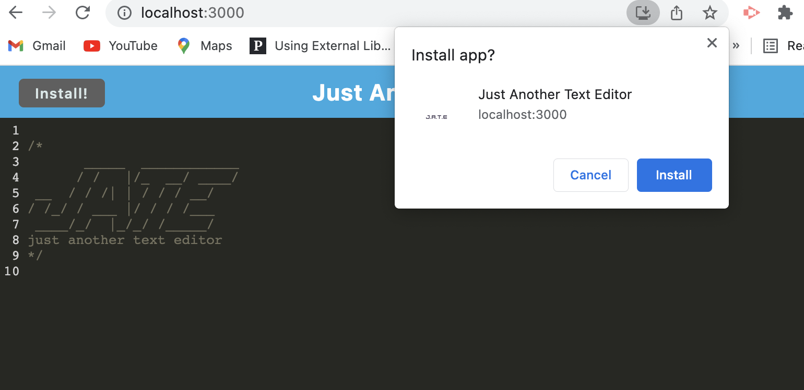

# PWA: Text Editor

## Table of Contents
- [Description](#description)
- [What to expect](#what-to-expect)
- [Links](#links)
- [Screenshot](#screenshot)

## Description
This project is a PWA application which helps to create notes or code snippets with or without an internet connection, so that it can reliably retrieved for later use.

## What to expect
* On opening application in editor, user should see a client server folder structure.
* `npm run start` from the root directory, application should start up the backend and serve the client.
* On running the text editor application from terminal, JavaScript files have been bundled using webpack.
* On running webpack plugins, there is a generated HTML file, service worker, and a manifest file.
* On using next-gen JavaScript in application, the text editor still functions in the browser without errors.
* Opening the text editor, IndexedDB has immediately created a database storage.
* On entering content and subsequently click off of the DOM window, the content in the text editor has been saved with IndexedDB.
* Reopening the text editor after closing it, the content in the text editor has been retrieved from the IndexedDB.
* Clicking on the Install button, the web application is downloaded as an icon on desktop.
* Loading the web application, there should be a registered service worker using workbox.
* On registering a service worker, user should have static assets pre cached upon loading along with subsequent pages and static assets.
* Deploying to Heroku, should have proper build scripts for a webpack application.

## Links
* GitHub: https://github.com/sinka27/PWA-Text_Editor
* Deployed Page: https://pwajate.herokuapp.com/

## Screenshot
 

## Credits:
Parul Raj
Joe Rehfuss
Brett Belka
Frantz Felix